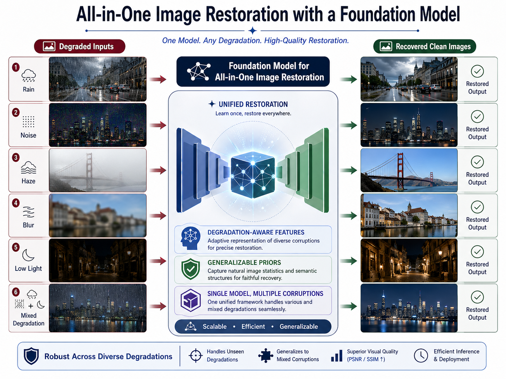

# 🌟 Awesome NextGen Image Restoration

**A curated list of Next-Generation All-in-One Image Restoration (AiOIR) resources.** *Covering Foundation Models, Mixture-of-Experts (MoE), Diffusion Priors, and Vision-Language Guidance.*

[**Papers**](#-the-foundation--next-gen-era-2024-2025) • [**Datasets**](#-popular-datasets) • [**Contributing**](#-contributing)

  

## 🔥 News
* **[28 April 2026]** Repository launched as `Awesome-NextGen-Image-Restoration`!

---

## 📌 Table of Contents
* [🚀 The Foundation & Next-Gen Era (2024–2025)](#-the-foundation--next-gen-era-2024-2025)
* [🛠️ Unified & All-Weather Restoration (2022–2023)](#️-unified--all-weather-restoration-2022-2023)
* [🏛️ Classic Backbones & Task-Specific Models](#️-classic-backbones--task-specific-models)
* [📊 Popular Datasets](#-popular-datasets)
* [🤝 Contributing](#-contributing)

---

## 🚀 The Foundation & Next-Gen Era (2024–2025)

The field is currently moving towards **Vision-Language Guidance** (CLIP, human instructions), **Foundation Models** (million-scale data), **Mixture-of-Experts (MoE)**, and **Diffusion Priors**.

| Year | Venue | Model Name | Key Contribution | Target Degradations | Code | Paper
| :--- | :--- | :--- | :--- | :--- | :---: |:---: |
| 2025 | CVPR | **DFPIR** | Feature perturbation to reduce task interference | Noise, Rain, Haze, Blur, Low-light |  | [📄](https://openaccess.thecvf.com/content/CVPR2025/papers/Tian_Degradation-Aware_Feature_Perturbation_for_All-in-One_Image_Restoration_CVPR_2025_paper.pdf)
| 2025 | CVPR | **Defusion** | Visual-instructed degradation diffusion | Diverse & Mixed | - | [📄](https://openaccess.thecvf.com/content/CVPR2025/papers/Luo_Visual-Instructed_Degradation_Diffusion_for_All-in-One_Image_Restoration_CVPR_2025_paper.pdf)
| 2025 | ICCV | **FoundIR** | Restoration foundation model (Million-scale data) | Real-world Mixed | [🔗](#) |[📄](#)
| 2025 | CVPR | **MoCE-IR** | Mixture-of-Complexity Experts routing | General Image Restoration | [🔗](#) |[📄](#)
| 2025 | TIP | **M2Restore** | MoE Mamba-CNN with CLIP-guided routing | Rain, Snow, Haze, Raindrop | [🔗](#) | [📄](#)
| 2025 | CVPR | **GenDeg** | Diffusion-based degradation synthesis | Haze, Rain, Snow, Blur, LL | [🔗](#) | [📄](#)
| 2025 | ICLR | **AdaIR** | Degradation-adaptive dynamic modulation | Multiple | [🔗](#) | [📄](#)
| 2024 | ICLR | **DA-CLIP** | Degradation-aware CLIP features | Multiple | [🔗](#) | [📄](#)
| 2024 | ECCV | **InstructIR** | Human-written text instructions for control | Noise, Rain, Blur, Haze, LL | [🔗](#) | [📄](#)
| 2024 | CVPR | **PromptGIP** | General image processing with prompt guidance | Multiple image tasks | [🔗](#) | [📄](#)
| 2024 | ICLR | **Xformer** | Hybrid Spatial/Channel dual-branch Transformer | Denoising | [🔗](#) | [📄](#)

---

## 🛠️ Unified & All-Weather Restoration (2022–2023)

These models focus on handling multiple degradations (e.g., weather or noise/blur) within a single set of weights, pioneering the "All-in-One" paradigm.

| Year | Venue | Model Name | Key Contribution | Target Degradations | Code | Paper
| :--- | :--- | :--- | :--- | :--- | :---: | :---: |
| 2023 | NeurIPS| **PromptIR** | Learnable degradation prompts for blind IR | Noise, Rain, Haze | [🔗](#) | [📄](#)
| 2023 | TPAMI | **WeatherDiff**| Diffusion prior for weather restoration | Rain, Haze, Snow | [🔗](#) | [📄](#)
| 2023 | CVPR | **GridFormer** | Grid-like Transformer for adverse weather | Rain, Haze, Snow | [🔗](#) | [📄](#)
| 2023 | CVPR | **DiffUIR** | Diffusion model for unified image restoration | Multiple | [🔗](#) | [📄](#)
| 2023 | ICML | **ShuffleFormer**| Random shuffle local attention | Denoising, Deraining, Deblur | [🔗](#) | [📄](#)
| 2022 | CVPR | **AirNet** | Contrastive degradation-aware encoder | Noise, Rain, Haze | [🔗](#) | [📄](#)
| 2022 | CVPR | **TransWeather**| Transformer-based unified weather removal | Rain, Haze, Snow, Raindrop | [🔗](#) | [📄](#)

---

## 🏛️ Classic Backbones & Task-Specific Models

High-performance architectures that serve as the foundation for modern All-in-One systems.

<b>Click to expand Classic Architectures (2017-2022)</b>

| Year | Venue | Model Name | Key Contribution | Task |
| :--- | :--- | :--- | :--- | :--- |
| 2022 | CVPR | **Restormer** | Channel-wise self-attention & Gated FFN | Denoise, Derain, Deblur |
| 2022 | CVPR | **MAXIM** | Multi-axis gated MLP (Global-Local) | Denoise, Deblur, Enhance |
| 2022 | ECCV | **NAFNet** | Nonlinear-activation-free baseline | Denoising, Deblurring |
| 2022 | CVPR | **DGUNet** | Deep generalized unfolding network | Denoise, Deblur, Derain |
| 2022 | CVPR | **Uformer** | Encoder-decoder with local window attention | Denoise, Deblur, Derain |
| 2021 | ICCVW | **SwinIR** | Residual Swin Transformer blocks | SR, Denoising, JPEG |
| 2021 | ICCV | **Swin** | Vision Transformer with shifted windows | General Backbone |
| 2021 | CVPR | **IPT** | Large-scale pre-trained Transformer | SR, Denoise, Derain |
| 2021 | CVPR | **MPRNet** | Multi-stage progressive restoration | Denoise, Derain, Deblur |
| 2020 | ECCV | **MIRNet** | Multi-scale feature fusion with attention | Denoising, Enhancement |
| 2018 | ECCV | **RCAN** | Residual channel attention for high-freq | Super-resolution |
| 2018 | CVPR | **RDN** | Residual dense connections | Super-resolution |
| 2018 | TIP | **FFDNet** | Noise-level-map conditioned CNN | Denoising |
| 2017 | CVPRW | **EDSR** | Enhanced residual blocks for SR | Super-resolution |
| 2017 | TIP | **DnCNN** | Residual learning for Gaussian denoising | Denoising |

---

## 📊 Popular Datasets

* **All-in-One / Weather:** [Snow100K](#), [Rain13K](#), [Outdoor-Rain](#)
* **Denoising / Deblurring:** [GoPro](#), [SIDD](#), [BSD68](#)
* **Foundation Pre-training:** [LSDIR](#), [ImageNet](#)

---

## 🤝 Contributing

Contributions make the open-source community an amazing place! If you want to add a paper:

1.  Check if the paper is already in the list.
2.  Fork the repository and create your feature branch.
3.  Add the paper to the appropriate category, ensuring the table remains sorted by **Year (Descending)**.
4.  Submit a Pull Request.

---

  <b>If you find this repository helpful, please consider leaving a ⭐!</b>

